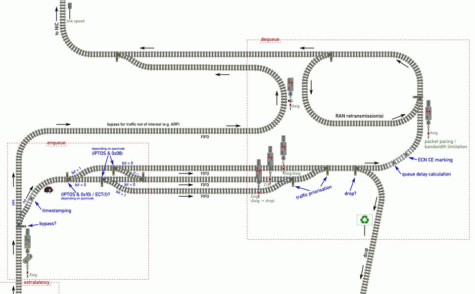
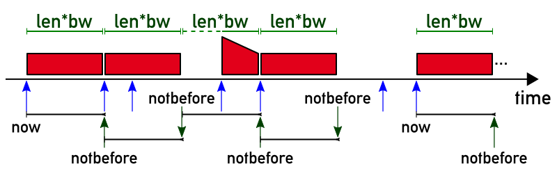

## Operation of the `sch_janz` qdisc

This qdisc for the Linux kernel implements the simulation of a (one) UE
(user equipment) 5G L4S slice connection on egress. The Linux networking
subsystem will invoke the qdisc on outgoing, both locally-originated and
forwarded, traffic from OSI layer 3 only; therefore, it must be employed
in a router, not bridge, scenario.

The “back direction” must necessarily be simulated on the egress of the
“incoming” interface. Another `sch_janz`, as well as other qdiscs, may
be suitable; a JENS solution will be provided in time.

The following documentation pertains to the operation of one `sch_janz`
qdisc in one direction. If another `sch_janz` qdisc is used for the
other/opposite direction, it operates completely indepently; the same
documentation will apply identically but mirrored. (This breaks symmetry
for “extralatency”, but it is expected that this makes no difference in
practice for the kinds of scenarios the JENS is intended to simulate.)

### Overview diagram

Please use the following diagram with the description, as it will refer
to elements thereof to explain the path packets take.

(click to expand)

### general packet flow

Packets to send may originate either locally (in which case the Linux kernel
may withhold packets for a while based on local buffers; see [the SCReAM
script](https://github.com/EricssonResearch/scream/blob/master/gstscream/scripts/sysctl.sh)
to set limits for benchmarking) or remotely (Layer 3 forwarding/routing).

When the/a qdisc is configured on an interface, the kernel sends the
packet to the qdisc’s `enqueue` method.

### enqueue

When the Linux kernel has a network packet to send it passes that to
the qdisc’s enqueue method (which it registered with the kernel upon
module initialisation). The `sch_janz` enqueue method works as follows:

#### extralatency

If an `extralatency` is configured on the qdisc, it is modelled as extra
packet delay that occurs “before” it arrives at the qdisc.

Internally, this is achieved by doing the same thing as without, but
the packet timestamp is put into the future, and when dequeueing, any
packets that have a timestamp that is still in the future is considered
to not be there yet.

#### analyse

The network packet arrives at the entry of the `enqueue` routine,
visualised as the entry signal “E”. Here, the packet is classified
based on:

- ethertype (e.g. IPv6 or ARP)
- if IPv4 or IPv6: layer 3 headers
  - QoS byte/IPv6 traffic class byte (DSCP + ECN bits)
  - source/destination address (for reporting)
  - next header(s) (IPv4 protocol field)
- if TCP/UDP over IP: layer 4 headers
  - source/destination port (for reporting)
- else if ICMPv6: layer 4 headers
  - ICMP type/code (e.g. neighbour discovery)

If the packet has no QoS byte (it is not IP or too short),
a suitable one is synthetisised:

- `0x10` (`IPTOS_LOWDELAY`) for (currently)
  - ARP, RARP
  - PPPoE discovery (but not data)
- `0x08` (`IPTOS_THROUGHPUT`, bulk) for (currently)
  - Ethernet loopback
- `0x00` otherwise

#### bypass

If the network packet does not belong to traffic of interest,
but rather is infrastructure for the underlying transport network
(e.g. ARP or neighbour discovery), the switch past the Esig E is
set to straight, so the packet goes into the bypass FIFO (direction
“Y”), which finishes the enqueue process.

Note: this is not currently implemented

Otherwise, the packet continues on the “no” (“N”) path, curving.

#### enqueue (proper)

The packet is timestamped (see above for `extralatency`); the
timestamp as well as the QoS byte, its memory usage (for accounting),
IP version, nexthdr and TCP/UDP ports are recorded with the packet.

Then, the destination FIFO is determined based on the QoS byte and
the configued `qosmode`:

- 0 (default): this mode is designed to help the operator avoid
  accidental lockout; just as the default Linux qdisc works, the
  packet is sent to the FIFO **L**owdelay, **N**ormal, **B**ulk
  based on the QoS byte’s IPTOS bits:

  - start in the middle track (“normal”)
  - when `IPTOS_LOWDELAY` (`0x10`) is set go up one track
  - if `IPTOS_THROUGHPUT` (`0x08`) is set go down one track

  Packets with both set end up back in the middle. This is the
  method depicted in the diagram above.

  It is expected that the traffic of interest sorts into the
  **N**ormal FIFO, and that any present “pollutant traffic”,
  if it is not possible to route it elsewhere, ends up in the
  bulk FIFO; emergency access via lodelay traffic is possible.

  Note: the use of IPTOS bits, while the “older” standard
  compared to DSCP, matches what both Linux and usual applications
  such as SSH, do (SSH automatically sets one of these, lodelay
  for interactive, bulk for SCP/SFTP/rsync sessions) and what is
  expected on the open internet. It is observed and expected that
  DSCP is used only within ISP networks or by explicit agreement
  by all involved parties but not as default mode of operation.
  For DSCP networks, please choose one of the other `qosmode` options.

  Note: bulk traffic can still negatively impact normal traffic.
  Therefore it is highly recommended that separation between traffic
  of interest and “uninteresting” traffic, SSH or “dirt traffic”, be
  done using the `sch_multijens` qdisc instead.

- 1: this mode is the closest to the 5G RAN operation. IP traffic is
  routed to the **N**ormal FIFO ignoring the QoS byte (similarly to
  how the RAN does not reorder packets currently).

  Note: this mode is **highly** recommended.

- 2: this mode is provided to ease setting up testbeds. IP traffic
  marked as `ECT(1)` (L4S-capable opt-in) or `CE` is sorted into the
  **L**owdelay FIFO and other IP traffic in the **N**ormal one.

  Note: outside of testbeds, this may not be desirable as packets
  that were already marked ECN `CE` before arriving will sort as
  high because they cannot be distinguished between `ECT(0)` and
  `ECT(1)` at that point. For testbeds, this would not happen as
  packets originate from the ingress interface’s LAN.

  Note: for the same reasons as outlined above, this mode should
  be avoided, in favour of `sch_multijens`.

Note: nōn-IP traffic still sorts by the (synthetic) QoS byte as it
is assumed that it is not traffic of interest to L4S test scenarios.
With bypass (see above) this is probably not relevant, though.

The packet is now sorted into one of three FIFOs; the switches will
be set accordingly. Before the packet is shunted to the FIFO though,
a check is done whether the qdisc is “full”, in which case the first
packet on the FIFOs (see below) is sent to _drop_ first. This method
of dropping the oldest packet (instead of the newest to be enqueued)
ensures that any drop feedback has a lower round-trip time. Once the
queue has sufficient space, the dwarf signal “D” changes, permitting
the packet to shunt into its designated FIFO, finishing enqueueing.

### FIFOs

After enqueue, the packets are put into a FIFO where they wait for the
respective signal (Y for bypass; L, N or B respectively for operative
traffic) to change so they can proceed. For bypass traffic that’s an
Asig (exit signal), passing them on to the NIC (network interface) at
(underlying) link speed. For regular traffic, things are a bit more
complicated (see below) but the waiting is true for these as well.

These signals are in the `dequeue` domain however. Linux splits the
process of sending packets into two parts, and they are not called
one after another — rather, `enqueue` is called whenever something
(a local application or routing) wants to send whereas `dequeue` is
called whenever the network interface is open to receive new frames
to pass on to the physical link.

#### drop checks

As the RAN, `sch_janz` occasionally (currently: each time one of the
`enqueue` and `dequeue` methods is called) tests whether a drop check
is to be performed. A drop check is run every 200 ms (+ scheduling
delay) and determines:

- whether at least one packet held in the L/N/B FIFOs is older than 100 ms
  - if so, one packet is dropped
- whether at least one packet held in the L/N/B FIFOs is older than 500 ms
  - all packets older than 500 ms will also be dropped

Dropping a single packet will change the switch marked as “drop?” so
that packets go in the direction of “drop” ♲ (and would, in a real train
station, indicate “D” as direction in the L/N/B signals). It then checks
the FIFOs in order: first the “L” FIFO, then the “N” FIFO, then the “B”
FIFO are checked for packet presence. The first one found gets its signal
set to green (operating as an Asig (exit signal)), and the packet is sent
to Linux to free the memory and other resources used by it.

Since the packets have (per-FIFO) ordering by timestamp, the first one is
always the “oldest” one (the one with the lowest timestamp) so dropping
all packets older than 500 ms works the same, except the respective first
packets of each FIFO is dropped in turn, until the respective head is
either younger or the FIFO is empty. This is also a useful property for
the “qdisc is full” dropping on enqueue as described above.

### dequeue

When the NIC has sufficient capacity to send out a packet, the Linux kernel
calls the `dequeue` qdisc method (possibly multiple times in short sequence).

If the “Y” FIFO (bypass) holds packets, the first one is sent onwards to
the NIC. Note: this is not implemented yet.

Otherwise if `q->notbefore` (see below) is still in the future, control is
returned to the kernel indicating no packet is yet ready to send, and to
call us again in `now() - q->notbefore` ns at most.

Next, the L, N and B FIFOs are, in order, tested for packets and the first
one is sent onwards to qdelay calculation. The “drop?” switch stays straight,
direction “N” (= NIC) is indicated on the respective signal L/N/B acting as
intermediate signal (Zsig), and one packet goes on to the right.

Note: “traffic priorisation” corresponds to testing the FIFOs in the order
mentioned. To support `extralatency`, a packet whose enqueue timestamp is,
at that point, still in the future, is considered absent (and because the
FIFOs are in order, indicates that that FIFO is empty). If the user lowers
`extralatency` during operation, later packets have “older” timestamps, but
this is not considered here as `extralatency` is a mostly constant bias.

The queue delay is calculated as the difference between the dequeue timestamp
(i.e. “now”) and the enqueue timestamp as recorded earlier (`extralatency` is
not included). If the queue delay is higher than the configured limits (refer
to `tc-janz(8)` for the `markfree` and `markfull` options) and the packet is
ECN capable (i.e. the ECN bits aren’t zero), the packet’s IP (or Legacy IP)
header is modified in-flight to mark the packet ECN `CE` (congestion
experienced) so AML algorithms can recognise that the packet would possibly
have been dropped in regular AQMs and lower the sending bandwidth / rate.

#### bandwidth limitation

The next step for the dequeued network packet is bandwidth limitation,
visualised through the exit signal “A”, in front of which the packet
waits until its bandwidth allotment is available, and which is
implemented in `sch_janz` as packet pacing:

The gross length of the packet (which in Linux includes some, but not all,
layer 2 framing (e.g. the Ethernet header is present but not the trailer))
is multiplied with the currently configured bandwidth represented as
nanoseconds per byte. Then, `q->notbefore` is set to (at first) the current
time plus the size*bandwidth product, indicating that the next packet can
be sent by then at the earliest.

However, the kernel can call us at varying intervals so if called *after*
`q->notbefore` but the last time we were called a packet was sent, the
preceding `q->notbefore` value (plus size*bandwidth) is set instead, so
we can saturate the requested bandwidth. (If the last call resulted in not
sending a packet, however, the dequeue current time is used as start time
to not send more than the configured bandwidth.)

##### example diagram

](pacing.png "sch_janz packet pacing diagram")

In this diagram, we see the packets output on a time axis. To ease
explanation, equal-sized packets are sent.

The blue arrows are the times `sch_janz` is called by the Linux kernel
when it wants to send out a packet. The first time this happens, one
packet (red block) is sent out, its length is calculated with the
currently set bandwidth (in nanoseconds per byte) and added to `now`
to get `notbefore`, a timestamp which is then stored away; `sch_janz`
also notes we have just sent a packet.

The second time `sch_janz` is called (blue arrow), it coïncides with
precisely the stored `notbefore` time, so another packet is sent the
next `notbefore` is calculated and saved and the just-sent-a-packet
indicator is kept on.

The third blue arrow occurs **before** the saved `notbefore`, so the
kernel is told to please come back later (at `notbefore - now()`, to
be exact — note it may still decide to call back earlier or later, the
time requested is merely a hint) and nothing is sent. But since there
is still a packet “in flight”, the just-sent-a-packet indicator is not
changed.

The fourth blue arrow, however, occurs **after** the saved `notbefore`.
But since we have been sending a packet as last action, we just send a
packet now at maximum link speed and still calculate the next `notbefore`
based on the previous `notbefore`, not `now`, in order to be able to
saturate the underlying link at the configured bandwidth even when called
at different intervals from those indicated to the kernel to call us back.

This assumes that the underlying link speed is higher than the configured
bandwidth, of course. At 10GigE timing, the packet arrives a little later
at the recipient than nanosecond-precise sending would have achieved, but
(usually) still within its length-bandwidth-product interval (though note
that multiple packets may be burst-sent at once if the call occurs _much_
past `notbefore`), and, more importantly, the average/measured bandwidth
is still the configured one. (If the underlying link is not fast enough,
the kernel will not call back for another packet quickly save for buffers
in the NIC, so that won’t be an issue normally. The JENS simulations are
normally setting around 1‥50 Mbit/s on a 100+ Mbit/s link, so the link
speed will be sufficiently fast unless the JENS NUC is kept at 100%CPU.)

The fifth blue arrow occurs after the backdated `notbefore` from the burst
packet has expired, so we continue normally.

At the sixth blue arrow, the application has no packet to send (i.e. all
three FIFOs (not shown) are empty), so the just-sent-a-packet indicator
is reset.

At the seventh blue arrow, the next `notbefore` will then again be
calculated from `now` because the just-sent-a-packet indicator was off
as there was no packet in flight.

Note that the bypass FIFO does not affect the just-sent-a-packet indicator
or `notbefore` calculation in any way as the calls (blue arrows) are only
considered when the bypass FIFO is empty. While this can result in bypass
traffic noticeably delaying traffic of interest, given the in-flight and
backdating `notbefore` mechanism this effect should be limited in practice.

##### after packet pacing (back to the overview diagram)

The packet continues on, going into a left curve…

#### RAN retransmissions

In the 4G (LTE) and 5G networks, a number of packets are subject to
retransmissions, possibly more than once even. Retransmissions due
to bad link quality are not modelled by `sch_janz`; their net effect
should be included in the DRP (data rate pattern) in use. However,
systematic retransmissions *are* modelled by `sch_janz` because they
have measurable impact on latency as link usage approaches capacity.

In the current qdisc implementation, this is modelled after the RAN,
in a model (acknowledged by an Ericsson representative) simplified
as follows:

Packets have a chance of retransmission, from a target BLER of 10%:
- 0.1¹ once
- 0.1² twice
- 0.1³ thrice
- 0.1⁴ four times
- 0.1⁵ five times
- six or more times is not simulated

(For this reason, with retransmission simulation enabled, the DRP
should be scaled up 10% compared to operation without it.)

Retransmission chance is stochastic, per packet. Sub-packet units
are not affected. Since the RAN doesn’t reorder packets, `sch_janz`
also doesn’t (i.e. all packets that transfer after one that is
retransmitted also enter the loop, and once the retransmission delay
is over, all packets from the loop pass on to the NIC at underlying
wire speed; if the link is fast enough this should model the RAN
behaviour sufficiently closely).

The retransmission delay depends on the radio operation mode (TDD,
FDD, …) and other factors. In a first stage, HARQ RTT of 8 ms is
used for the simulation, resulting in:

- 10% of all packets get a retransmission delay of 8 ms
- 1% of all packets get a retransmission delay of 16 ms
- 0.1% of all packets get a retransmission delay of 24 ms
- 0.01% of all packets get a retransmission delay of 32 ms
- 0.001% of all packets get a retransmission delay of 40 ms

Note: this is not currently implemented

#### onwards to the NIC

After leaving `dequeue`, either directly from the bypass FIFO or
having passed packet pacing and possibly RAN retransmissions, the
packet is returned to the Linux kernel which will then send it to
the network card to leave at wire speed. To get best results, the
underlying link speed should be the maximum supported, i.e. keep
the link speed at gigabit Ethernet or even faster if available
instead of reducing it to, say, 100-baseTX, even if you only ever
simulate 10–20 Mbit/s reduced data rate, because, as outlined in
various places above, `sch_janz` out of necessity simulates part
of radio conditions and in-UE processes in the qdisc and therefore
before entering the physical link underlying the simulation.

It is expected that the remaining “burstiness” of the actual
network packets arriving at the recipient can be smoothed out
in the millisecond, or at worst four-millisecond, scale, which
is approximately the granularity the Linux kernel operates at
anyway.

## Operation of the `sch_multijens` qdisc

This qdisc for the Linux kernel implements the simulation of a
fixed number of L4S slices, each for one UE, each operating as
documented for `sch_janz` above. The bypass (not yet implemented)
is global and normally reported in UE#0.

The packets leave the bypass and “`sch_janz` subqueues” in a
simple round-robin skipping empty queues until their next turn.
This may possibly be changed in the future.
